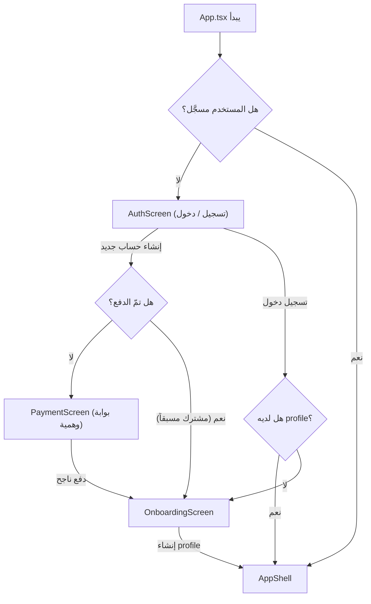

# صفحة تسجيل الدخول / إنشاء حساب + قاعدة بيانات + بوابة دفع تجريبية

## ملخّص
إضافة نظام مصادقة (Authentication) كامل يتضمّن:
1. **صفحة تسجيل دخول / إنشاء حساب** احترافية (Login + Signup)
2. **قاعدة بيانات IndexedDB محلية** مُجرَّدة عبر طبقة `db.ts` لتخزين المستخدمين والاشتراكات
3. **بوابة دفع تجريبية وهمية** (Mock Payment Gateway) — تحاكي سلوك بوابة حقيقية (نموذج بطاقة، تحقق، تأكيد) لكن بدون معاملة مالية فعلية. السعر: **$15 للفصل الدراسي الكامل**

## المتطلبات المعمارية

- **لا تعتمد على Backend/API خارجي** — كل شيء يعمل محلياً (IndexedDB + in-memory fallback)
- **التخزين الحالي (storage.ts)** لا يُمسّ — نُضيف طبقة DB جديدة بجانبه
- **التدفق الحالي (Onboarding → AppShell)** يُستبدل بـ: `AuthScreen → [PaymentGate] → Onboarding → AppShell`
- **الكود الحالي لا يتغيّر** إلا ملف [App.tsx](file:///d:/masar/masar-app/src/App.tsx) (إضافة حارس المصادقة) و[OnboardingScreen.tsx](file:///d:/masar/masar-app/src/components/OnboardingScreen.tsx) لا يُمسّ

---

## التدفّق الجديد



---

## التغييرات المقترحة

### طبقة قاعدة البيانات (Database Layer)

#### [NEW] [db.ts](file:///d:/masar/masar-app/src/lib/db.ts)
- طبقة IndexedDB مُجرَّدة مع fallback لـ `localStorage`
- جداول: `users` (email, passwordHash, createdAt) و `subscriptions` (userId, plan, status, paidAt, expiresAt)
- دوال: `createUser()`, `authenticateUser()`, `getSubscription()`, `activateSubscription()`
- تشفير كلمة المرور بـ `crypto.subtle.digest('SHA-256', ...)` (Web Crypto API)
- Logging: كل عملية DB تُسجَّل في `console` بصيغة `[MasarDB]`

---

### نظام المصادقة (Auth System)

#### [NEW] [useAuth.ts](file:///d:/masar/masar-app/src/lib/useAuth.ts)
- Hook مركزي يدير حالة المصادقة: `{ user, isAuthenticated, isPaid, login, signup, logout, loading }`
- يحفظ الجلسة عبر `sessionStorage` (تُمسح عند إغلاق المتصفح)
- يتحقق من حالة الاشتراك

#### [NEW] [AuthScreen.tsx](file:///d:/masar/masar-app/src/components/AuthScreen.tsx)
- صفحة واحدة بتبويبين: **تسجيل الدخول** و**إنشاء حساب**
- حقول: البريد الإلكتروني، كلمة المرور، (الاسم عند التسجيل)
- تحقق بـ Zod (موجود في المشروع)
- تصميم متناسق مع لغة التصميم الحالية (ink, sprout, ember, paper...)
- شعار مسار (MasarMark) + عنوان وصفي
- دعم Dark Mode

---

### بوابة الدفع التجريبية (Mock Payment Gateway)

#### [NEW] [PaymentScreen.tsx](file:///d:/masar/masar-app/src/components/PaymentScreen.tsx)
- واجهة بطاقة ائتمان وهمية تفاعلية:
  - رقم البطاقة (16 رقم مع تنسيق تلقائي)
  - تاريخ الانتهاء (MM/YY)
  - CVV (3 أرقام)
  - اسم حامل البطاقة
- **قواعد القبول الوهمية**:
  - أي رقم بطاقة من 16 رقم يبدأ بـ `4` (Visa pattern) → يُقبَل
  - رقم ينتهي بـ `0000` → يُرفض (لمحاكاة الرفض)
  - أي رقم آخر صالح التنسيق → يُقبَل
- حالة معالجة (Processing) بتأخير 2 ثانية مع spinner
- حالة نجاح مع رسالة تأكيد وإيصال
- حالة رفض مع رسالة خطأ
- السعر: **$15.00 USD — الفصل الدراسي الكامل (9 أشهر)**
- تصميم يحاكي بوابات Stripe/Checkout الحقيقية
- ملصق "بيئة تجريبية" ظاهر بوضوح

#### [NEW] [mockPayment.ts](file:///d:/masar/masar-app/src/lib/mockPayment.ts)
- محرّك المعالجة الوهمية (pure functions):
  - `validateCardNumber()` — Luhn check + format
  - `validateExpiry()` — future date check
  - `processPayment()` → `Promise<PaymentResult>` بتأخير محاكي
- أنواع: `PaymentResult`, `CardInfo`

---

### تعديل ملفات موجودة

#### [MODIFY] [App.tsx](file:///d:/masar/masar-app/src/App.tsx)
- إضافة `useAuth` hook
- تدفّق جديد: `AuthScreen → PaymentScreen → OnboardingScreen → AppShell`
- الكود الحالي (tabs, dashboard, etc.) لا يتغيّر — يُلفّ فقط بشرط المصادقة

---

## ملف PROJECT_MAP.md

#### [NEW] [PROJECT_MAP.md](file:///d:/masar/masar-app/PROJECT_MAP.md)
- خريطة المشروع الكاملة مع المكونات الجديدة
- توجيهات المصادقة وقاعدة البيانات

---

## ملاحظات تقنية

> [!IMPORTANT]
> **بوابة الدفع تجريبية بالكامل** — لا تنفّذ أي عملية مالية حقيقية. يظهر ملصق "بيئة تجريبية" بوضوح على الشاشة. عند الانتقال للإنتاج، تُستبدل `mockPayment.ts` و`PaymentScreen.tsx` ببوابة حقيقية (Stripe, Chargily, إلخ).

> [!NOTE]
> **IndexedDB مع localStorage fallback** — يدعم جميع المتصفحات. لا اعتماد على مكتبات خارجية جديدة. يُستخدم Web Crypto API (مدعوم في كل المتصفحات الحديثة) لتجزئة كلمات المرور.

> [!WARNING]
> **تجزئة SHA-256 في المتصفح ليست بديلاً عن bcrypt في الإنتاج.** هذا الحل للعرض التجريبي المحلي فقط. في الإنتاج يجب استخدام backend حقيقي مع bcrypt/argon2.

---

## خطة التحقق

### اختبارات يدوية
1. ✅ إنشاء حساب → التحقق من حفظه في IndexedDB
2. ✅ تسجيل الدخول بنفس البيانات → الوصول للتطبيق
3. ✅ تسجيل الدخول بكلمة مرور خاطئة → رسالة خطأ
4. ✅ الدفع ببطاقة صالحة → نجاح + انتقال للـ Onboarding
5. ✅ الدفع ببطاقة تنتهي بـ 0000 → رفض مع رسالة
6. ✅ تسجيل الخروج → العودة لشاشة المصادقة
7. ✅ الميزات القديمة (Dashboard, Path, Leaderboard, Profile) تعمل بدون أي تغيير

### تشغيل المشروع
```bash
pnpm dev
```
